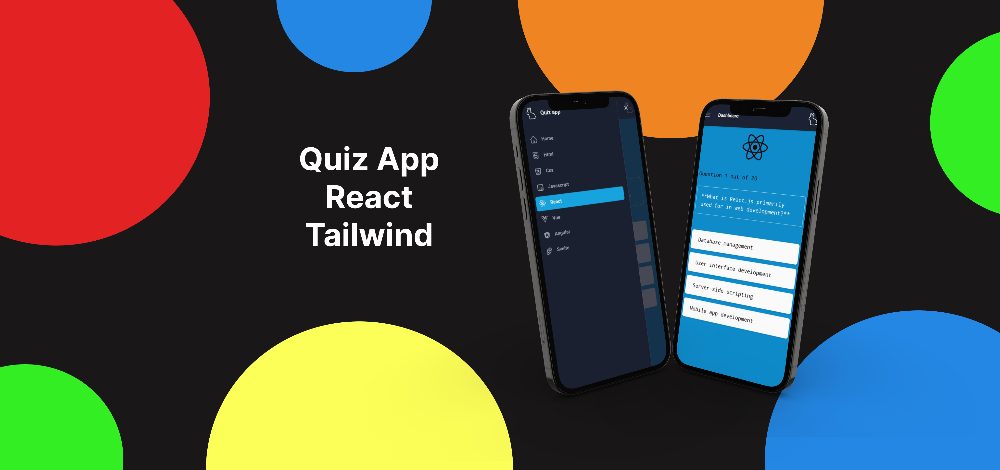
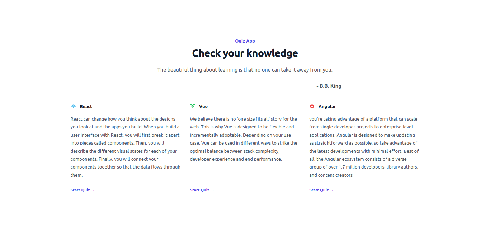
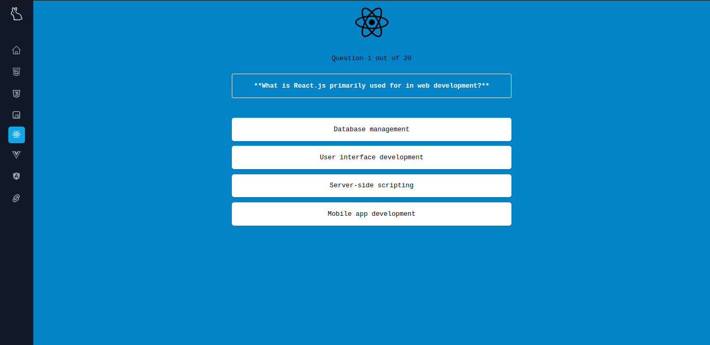

# Quiz App looks like

About Quiz App:

Finding the right job or mastering a new skill can be challenging. That's why I have developed an innovative quiz app to guide you on your path to success. my platform is all about empowerment through knowledge.

If you don't pass the test, don't worry! Quiz App is here to help you grow. Quiz App recommends lesson links and resources to help you improve your knowledge and readiness. You can retake the quiz at any time when you feel confident.





## Packages

| name              | version |
| ----------------- | ------- |
| @headlessui/react | ^1.7.17 |
| @heroicons/react  | ^2.0.18 |
| react-icons       | ^4.11.0 |
| tailwindcss       | ^3.3.3  |
| react-router-dom  | ^6.16.0 |

# Run app

### Install npm

```
npm i
```

### Run Project

```
npm run dev
```
